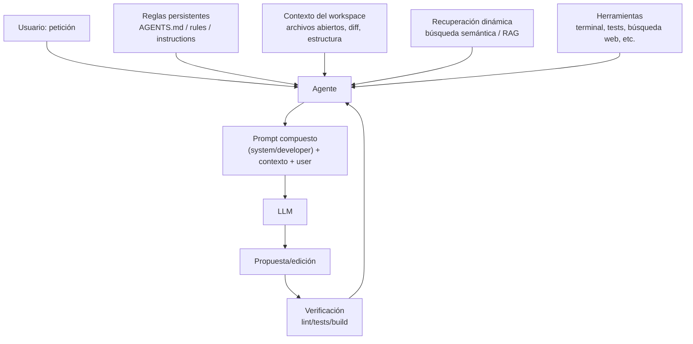
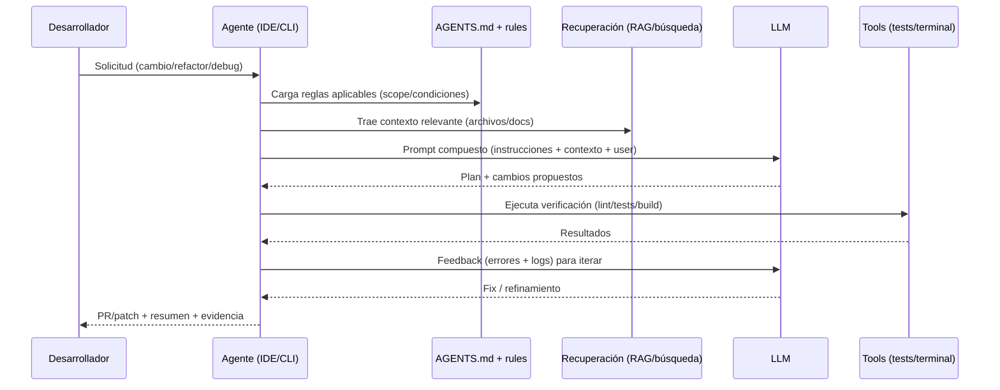

# AGENTS.md y archivos de reglas para agentes de programación asistidos por IA

## Resumen ejecutivo

AGENTS.md es un archivo Markdown “de instrucciones para agentes” que se está consolidando como un punto predecible y versionable donde declarar **cómo trabajar en un repositorio** (comandos de setup, cómo ejecutar tests, convenciones, restricciones, etc.). Se suele describir como un “README para agentes” y su adopción se ha extendido rápidamente en proyectos open source. 

En 2025–2026, además del estándar AGENTS.md, conviven formatos **específicos de herramienta** (por ejemplo, instrucciones para GitHub Copilot en `.github/copilot-instructions.md`, reglas por carpeta y ficheros `.instructions.md` en VS Code, reglas en `.clinerules/` para Cline, reglas en `.windsurf/rules` para Windsurf). La tendencia es clara: **contexto persistente + modularidad por carpeta + “progressive disclosure”** (dar lo mínimo siempre-on y enlazar/adjuntar lo adicional cuando haga falta). 

Técnicamente, estos archivos se integran en la “ventana de contexto” del LLM como parte del **mensaje de más alta prioridad** (system/developer/instructions) o como preámbulo persistente. Esto reduce alucinaciones porque disminuye el espacio de “suposiciones”: el modelo deja de inventarse comandos, rutas o normas y pasa a **seguir un contrato textual** que se inyecta sistemáticamente. La efectividad aumenta cuando se combina con recuperación de contexto (RAG/embeddings) y con límites sanos de longitud (evitar “lost in the middle” y degradación por exceso de contexto). 

El gran riesgo: estos ficheros también son una **superficie de ataque**. Se han documentado ataques tipo “Rules File Backdoor” donde un atacante introduce instrucciones maliciosas (incluso invisibles via Unicode) en archivos de reglas/instrucciones para que el agente genere código comprometido sin que el humano lo note. Por eso hay que tratarlos como “código”: revisión, ownership, escaneo y principios de mínima autoridad. 

Recomendación operativa para un equipo intermedio/avanzado: mantener un **AGENTS.md raíz pequeño** (setup + pruebas + estilo + seguridad + verificación), mover lo demás a documentación modular o AGENTS.md por subcarpeta, y complementar según herramienta con reglas condicionales (globs) y “workflows/skills” cuando el procedimiento requiera pasos repetibles. 

## Panorama de estándares y formatos por herramienta

AGENTS.md se plantea como un formato abierto y sencillo (sin esquema rígido) para guiar agentes de código, y su justificación principal es proporcionar un lugar **predecible** con instrucciones que serían “ruido” en el README humano (p. ej., comandos exactos, convenciones internas). 

En paralelo, los principales entornos han creado mecanismos similares de “instrucciones persistentes” (a veces compatibles con AGENTS.md, a veces con nombres/ubicaciones propias):

- ["company","OpenAI","ai company"]  Codex lee AGENTS.md y AGENTS.override.md tanto en un ámbito global (`~/.codex`) como por proyecto, concatenando archivos desde la raíz hacia el directorio actual, con límites de tamaño configurables.  
- ["company","GitHub","code hosting company"]  Copilot dispone de instrucciones de repositorio (`.github/copilot-instructions.md`) y de instrucciones por ruta con frontmatter `applyTo` en `.github/instructions/*.instructions.md` (y las aplica automáticamente). Además, Copilot coding agent anunció soporte para AGENTS.md (incluyendo ficheros anidados).   
- Windsurf soporta AGENTS.md con *scoping* automático por ubicación (raíz vs subdirectorios) y, por otro lado, reglas en `.windsurf/rules` con descubrimiento en workspace/subdirectorios y hasta el git root, con límites explícitos por fichero de reglas.   
- Cline estructura reglas en `.clinerules/` (y soporta múltiples formatos de otros ecosistemas), con precedencia entre reglas globales y del workspace, y con opción de reglas condicionales.   
- ["company","Google","tech company"]  Gemini en Android Studio documenta un modelo muy similar al de Codex/Windsurf: AGENTS.md buscado en el directorio actual y superiores, con posibilidad de varios ficheros para control fino, importación modular con `@ruta`, y notas de precedencia frente a GEMINI.md.   

A continuación, una tabla comparativa centrada en **qué se inyecta** y **cómo escala** (lo importante para ingeniería de contexto):

| Ecosistema / herramienta | Formatos de instrucciones versionables | Scoping / selección | Límites y notas técnicas relevantes |
|---|---|---|---|
| OpenAI Codex | `AGENTS.md`, `AGENTS.override.md` (global y por proyecto) | Cadena desde raíz (git root) hasta cwd; `override` sustituye al normal en cada directorio; concatena de “general → específico”.  | Límite por bytes (`project_doc_max_bytes`, 32 KiB por defecto) y “solo 1 fichero por directorio”.  |
| GitHub Copilot / VS Code | `.github/copilot-instructions.md` + `.github/instructions/*.instructions.md` con `applyTo` | `.instructions.md` se aplica por glob o por coincidencia semántica con la tarea (según VS Code).  | VS Code recomienda concisión; permite usar AGENTS.md para “always-on” y multi-agente.  |
| Copilot coding agent | `AGENTS.md` (incl. anidados) | AGENTS.md por zonas del repo, aplicable a partes específicas.  | Convive con `copilot-instructions.md`; hay fricción/solapamiento en tooling (p. ej., herramientas que aún sugieren crear instrucciones aun existiendo AGENTS.md).  |
| Windsurf | `AGENTS.md` + `.windsurf/rules` | AGENTS.md: scope automático por carpeta; `.windsurf/rules`: por globs/descripciones, deduplicación multi-workspace.  | Reglas limitadas a 12000 caracteres por fichero.  |
| Cline | `.clinerules/` (recomendado), `.clinerules` (legacy), y lee formatos “vecinos” | Orden de carga documentado; workspace > global; `.clinerules` prioriza.  | Permite “rules bank” para mantener contexto activo lean; ficheros combinados en un ruleset.  |
| Gemini (Android Studio) | `AGENTS.md` (múltiples) + importación `@file.md` | Busca en directorio actual y superiores; añade contenido “al comienzo de cada instrucción como preámbulo”.  | Precedencia local: GEMINI.md > AGENTS.md en el mismo directorio.  |
| Cursor (contexto relacionado) | Reglas por proyecto + open standard de “skills” | Se describen 4 modos de aplicación de reglas (always, intelligent, files, manual) y skills en `SKILL.md` como estándar abierto.  | Cursor también documenta técnicas para gestionar límites de contexto/sumarización en agentes.  |

Nota sobre `.windsurfrules` y `.cursorrules`: aparecen como nombres históricos o comunitarios y todavía se citan en guías no oficiales; la documentación actual de Windsurf pone el foco en `.windsurf/rules` + AGENTS.md. 

## Fundamentos técnicos de la inyección de contexto

### Qué significa “inyectar contexto” en un agente de coding

Un “coding agent” rara vez manda al modelo solo tu prompt. Normalmente compone una solicitud a partir de: (1) instrucciones de alto nivel (system/developer/instructions), (2) tu petición, (3) contexto del workspace (archivos relevantes, diffs, estructura), (4) resultados de herramientas (búsquedas, terminal, tests), y (5) reglas persistentes (AGENTS.md, rules por carpeta, etc.). Cline lo explica de forma directa: antes de enviar tu petición al LLM, agrega información del workspace, preferencias y codebase al system prompt. 

En APIs modernas (por ejemplo, en la API de ["company","OpenAI","ai company"] ), la jerarquía de seguimiento de instrucciones se articula explícitamente: instrucciones en rol *developer* o *system* tienen precedencia sobre rol *user*. 

### Tokens, ventana de contexto y por qué importa para reglas persistentes

La ventana de contexto es el total de tokens que el modelo puede “atender” (entrada + salida). Aunque muchas herramientas abstraen esto, a nivel técnico se vuelve un **presupuesto**: si llenas el contexto con reglas redundantes, queda menos espacio para el código relevante y para el razonamiento/planificación. En el extremo, algunas herramientas activan sumarización cuando se llega al límite, y esa sumarización puede degradar el “estado” del agente por ser compresión con pérdida (Cursor describe explícitamente este fenómeno y cómo mitiga la pérdida usando el historial como archivos consultables). 

Ejemplos de presupuestos (útiles para calibrar “cuánto cabe” en instrucciones):

- GPT-4o se documenta con una ventana de contexto de 128k tokens y un máximo de salida de 16.384 tokens.   
- Claude (planes de pago) se documenta típicamente con 200k tokens de contexto, y la propia documentación de Anthropic entra en detalles sobre ventanas efectivas con tool use/thinking.   

### System prompts, delimitación y estructura

Tanto OpenAI como Anthropic recomiendan estructurar el contexto con delimitadores (Markdown, XML) para hacer más claros los límites entre “datos”, “instrucciones” y “ejemplos”. Esto afecta directamente a cómo escribir AGENTS.md: encabezados, listas y secciones bien delimitadas no son “estética”, son ingeniería de parsing informal para el modelo. 

### Embeddings y RAG: el complemento “dinámico” a las reglas estáticas

AGENTS.md y reglas similares son **contexto estático** (persistente). Para el contexto **dinámico** (lo que cambia por tarea), muchos agentes aplican recuperación (búsqueda semántica / embeddings) para traer fragmentos de documentación o código al prompt. En literatura, Retrieval-Augmented Generation (RAG) combina memoria paramétrica con memoria no paramétrica (índices densos) y se ha mostrado capaz de producir lenguaje más factual/específico que un baseline sin recuperación. 

Aquí hay una tensión que impacta el diseño de AGENTS.md: **más contexto no siempre implica mejor rendimiento**. Trabajos sobre largos contextos muestran degradación cuando la evidencia está “en medio” del prompt (“lost in the middle”), incluso en modelos diseñados para largo contexto. Por eso conviene poner lo crítico al principio y usar modularidad/recuperación para el resto. 

### Por qué AGENTS.md reduce alucinaciones frente a “prompts normales”

En un prompt normal (“añade un endpoint y tests”), el modelo puede:

- inventar comandos de build/test,
- suponer el gestor de paquetes,
- elegir librerías no usadas,
- aplicar un estilo inconsistente,
- o “rellenar huecos” con supuestos sobre la arquitectura.

AGENTS.md reduce alucinaciones porque transforma esas suposiciones en un contrato: comandos canónicos, convenciones, rutas de verdad, y pasos de verificación, inyectados de forma consistente antes del trabajo (por ejemplo, Codex lee AGENTS.md “before doing any work”). 



La idea del diagrama (composición previa a la llamada al modelo) está alineada con cómo Cline describe su system prompt como un “puente” entre intención y acción, y con la jerarquía de roles/instructions en APIs. 

## Anatomía ideal de un AGENTS.md

Un AGENTS.md no tiene un esquema obligatorio (Markdown libre), pero las implementaciones efectivas tienden a converger en “lo operativo”: cómo instalar, cómo correr, cómo testear, y cómo evitar errores de estilo/arquitectura. El propio sitio del estándar muestra ejemplos mínimos con “setup commands”, “run tests” y “code style”. 

Además, el valor “granular” aparece cuando puedes poner AGENTS.md por carpetas y heredar contexto (Windsurf lo documenta como comportamiento central; Copilot coding agent y Codex también soportan anidamiento/overrides). 

Un marco práctico (de “cero a experto”) es pensar AGENTS.md como un contrato con tres capas:

1) **Orientación global (siempre aplica)**: propósito del repo + comandos canónicos + definición de “hecho” (verificación).   
2) **Convenciones transversales**: estilo, testing, seguridad, performance, compatibilidad.   
3) **Casos especiales por dominio/carpeta**: reglas específicas de `frontend/`, `backend/`, `infra/`, etc. (AGENTS.md anidados).  

Tabla-guía de secciones (con obligatoriedad práctica y coste aproximado en tokens). Las cifras de tokens son **orientativas** (depende del idioma, del tokenizer y de si añades ejemplos).

| Sección | Objetivo | ¿Obligatoria? | Tamaño recomendado (tokens aprox.) | Comentarios de diseño |
|---|---|---:|---:|---|
| “Qué es este repo” (1–3 líneas) | Evitar malentendidos de dominio | Sí | 30–120 | Define qué NO es el repo también (p. ej., “no tocar infra”). |
| “Comandos canónicos” (setup/build/test/lint) | Eliminar alucinaciones operativas | Sí | 80–250 | Basado en el espíritu “setup commands / run tests”.  |
| “Definition of done” (DoD) | Forzar verificación | Sí | 60–200 | Incluir pasos binarios (pasan/fallan). Recomendación frecuente en guías de reglas.  |
| “Code style / conventions” | Consistencia y menor review churn | Sí (si no hay otra fuente) | 120–400 | Preferir reglas accionables a adjetivos (“clean”). |
| “Testing guidelines” | Qué tests generar, cómo nombrar, qué cubrir | Muy recomendable | 150–450 | Evitar cobertura genérica; ponerse específico (framework, patrones). |
| “Seguridad y datos” | Evitar prácticas peligrosas | Muy recomendable | 120–400 | Incluir “nunca”/“siempre” solo en invariantes reales. |
| “Performance / observabilidad” | No degradar latencias/costes | Opcional | 80–250 | Útil en backends, SDKs y sistemas críticos. |
| “Ejemplos mínimos” | Enseñar patrones correctos | Opcional (pero potente) | 200–800 | Buen ROI si son patrones muy repetidos. |
| “Edge cases / gotchas” | Reducir bugs por suposiciones | Opcional | 100–300 | Especialmente útil si hay compatibilidad, feature flags, etc. |
| “Versionado y metadata” | Mantener vivo el contrato | Recomendable | 40–120 | Fecha, owner, última revisión, alcance. |

Dos detalles que suelen marcar la diferencia:

- **Ubicación y herencia**: si tu herramienta soporta scope por carpeta (Windsurf, Gemini, Copilot coding agent, Codex), usa varios AGENTS.md para mantener cada uno corto y contextual, sin repetir lo global.   
- **Compatibilidad con otros formatos**: en organizaciones con varias herramientas, Cline documenta explícitamente que puede leer formatos de Cursor y Windsurf además de AGENTS.md, lo cual permite converger en un “mínimo común” sin duplicación total.   

## Buenas prácticas de escritura, densidad y mantenimiento

### Lenguaje: natural, directo y con delimitadores

Las instrucciones deben ser **naturales y accionables** (lo que GitHub recomienda explícitamente para `copilot-instructions.md`) y, cuando aporten claridad, estructuradas con encabezados/listas. 

En términos de forma, OpenAI recomienda usar Markdown y/o etiquetas para delimitar partes lógicas del contexto y reducir ambigüedad. Esto se traduce en: evitar párrafos kilométricos y preferir secciones cortas con bullets concretos. 

### Densidad informativa y ahorro de tokens: ingeniería de “progressive disclosure”

Reglas persistentes consumen presupuesto en cada llamada. Aunque cada herramienta implementa distinto, la pauta de diseño es estable:

- lo que es “siempre relevante” va en el AGENTS.md raíz,
- lo específico va en AGENTS.md por carpeta o en archivos auxiliares enlazados/importados,
- y lo procedural repetible se convierte en workflows/skills.

Este patrón está explícitamente soportado en Gemini (importación con `@...` para modularizar AGENTS.md) y en Codex (cadena de instructions por directorio con overrides). 

En Cline, además, existe una idea parecida para mantener el contexto activo pequeño: un `.clinerules/` con lo activo y un “rules bank” fuera para activar solo cuando toca. 

### Modularización por carpetas y “reglas condicionales”

Cuando el repo es monorepo o multi-dominio, la modularización por carpetas suele ser superior a un “megaarchivo”:

- Windsurf: AGENTS.md en subdirectorios aplica automáticamente a esa zona.   
- Gemini: múltiples AGENTS.md en módulos, buscando hacia arriba, para control fino.  
- Codex: concatenación desde la raíz al cwd con precedencia del más específico.  
- VS Code / Copilot: `.instructions.md` con `applyTo` y también selección semántica para activar instrucciones por ruta/tarea. 

### Actualización y gobernanza: “instructions as code”

Si el agente se equivoca recurrentemente, es tentador añadir reglas sin más. Pero la gobernanza importa tanto como el contenido.

Prácticas que escalan bien:

- Tratar AGENTS.md/reglas como código: PR, CODEOWNERS, revisión por alguien que entienda el dominio y la seguridad. Esto es especialmente relevante por la existencia de ataques específicos a rules files.   
- Mantenerlas sincronizadas con el proyecto: guías de reglas (por ejemplo, sobre reglas de Cursor) insisten en mantenerlas actualizadas, y en incluir pasos de verificación al final para evitar regresiones silenciosas.   
- Registrar “última revisión” y “owner”, porque la documentación stale es especialmente peligrosa cuando se inyecta siempre (un humano duda; un agente suele actuar). Esto conecta con la evidencia de que el largo contexto no se usa de forma robusta (“lost in the middle”), así que la exactitud local pesa mucho.   

## Errores comunes, anti‑patrones y riesgos de seguridad

### Anti‑patrones que degradan la calidad del agente

1) **Vaguedad** (“escribe buen código”, “usa best practices”): Windsurf contrasta ejemplos “buenos” (concretos) vs “menos efectivos” (vagos).   
2) **Reglas contradictorias**: dos secciones que piden patrones opuestos (p. ej., “usar mocks” vs “no usar mocks”) hacen que el modelo “elija” de forma no determinista. (Recomendación: unificar, o mover a reglas condicionales por ruta/tarea).   
3) **Megaarchivos** que compiten con el propio código por tokens: la investigación sobre largos contextos muestra que poner mucha información no garantiza que el modelo encuentre lo relevante; además, el rendimiento puede degradar por posición (“lost in the middle”).   
4) **Duplicar el README**: si la información es útil para humanos, suele ser mejor vivir en documentación “de verdad” y que instrucciones de agente apunten a ella (progressive disclosure), evitando deuda de mantenimiento.   
5) **No incluir verificación**: reglas sin “cómo comprobar” acaban generando código plausible pero no ejecutable. Guías prácticas de rules enfatizan pasos verificables.   

### Riesgos de seguridad: prompt injection y “rules file backdoor”

Los ficheros de reglas/instrucciones tienen una propiedad peligrosa: se tratan como **input de alta confianza** (porque se inyectan en system/developer o preámbulos). Eso los convierte en vector de supply chain.

- “Rules File Backdoor” (Pillar Security) describe un ataque donde se incorporan instrucciones ocultas en archivos de configuración usados por agentes (incluyendo técnicas con Unicode invisible) para forzar generación de código malicioso sin que el usuario lo vea claramente.  
- OWASP mantiene guías específicas de prevención de prompt injection, subrayando que el problema nace de la separación difusa entre “instrucciones” y “datos”.  
- “Invisible prompt injection” con Unicode invisible es un subcaso bien descrito en investigación/industria de seguridad (p. ej., tendencias y escenarios con caracteres no visibles).  

Mitigaciones recomendadas (prácticas, no “teóricas”):

- Escaneo automático de caracteres invisibles/control en `.md`, `.mdc` y archivos de instrucciones dentro de CI (detección de rangos Unicode sospechosos).  
- Ownership estricto (CODEOWNERS) para carpetas de reglas + revisión obligatoria por seguridad cuando cambian. 
- Principio de mínima autoridad del agente (no permitir ejecución de comandos destructivos sin gating humano; aislar credenciales; segmentar acceso a repos). La prevención de prompt injection no es perfecta, así que hay que diseñar el sistema para fallar con daño acotado. 

## Estrategias avanzadas: contexto dinámico, adaptación por modelo y evaluación

### Contexto dinámico (RAG + herramientas) y persistencia

El patrón moderno no es “meterlo todo en AGENTS.md”, sino:

- AGENTS.md/reglas: invariantes y procedimientos.
- RAG/recuperación: documentación y código relevantes para la tarea.
- Herramientas: ejecutar tests, inspeccionar archivos, buscar símbolos.

Anthropic y OpenAI publican guías de “context engineering” y de gestión de memoria/contexto, enfatizando que el contexto debe ser informativo pero “tight”, y que el exceso de ruido degrada resultados. 

En entornos concretos:
- Windsurf separa “Rules” (manuales) de “Memories” (persistencia entre conversaciones). 
- Cline propone un “Memory Bank” como estructura documental para preservar contexto entre sesiones, aplicable con `.clinerules`. 

### Reglas modulares por carpeta y precedencia

Tienes tres mecanismos robustos para modularidad, con diferentes trade-offs:

- **AGENTS.md por carpeta** (scope automático): Windsurf y Gemini lo describen de forma explícita; Copilot coding agent lo soporta; Codex concatena desde raíz a cwd.   
- **Reglas condicionales por glob**: `.instructions.md` con `applyTo` en VS Code/Copilot y reglas por globs en sistemas de rules tipo `.windsurf/rules`.   
- **Overrides explícitos**: `AGENTS.override.md` en Codex permite sustituir reglas en un directorio sin duplicar el resto.  

### Adaptación por modelo: trade-offs útiles para escribir instrucciones

Aunque el contenido de AGENTS.md debería ser mayormente agnóstico, la **forma** (densidad, ejemplos, redundancia) conviene adaptarla según coste/ventana de contexto y capacidades.

| Modelo (ejemplos) | Ventana de contexto (documentada) | Qué suele funcionar mejor en instrucciones | Riesgos típicos | Ajuste práctico en AGENTS.md |
|---|---:|---|---|---|
| GPT-4o | 128k | Instrucciones concisas + delimitación clara + verificación/pasos.  | Derroche de tokens si el archivo crece; coste de meter ejemplos largos. | Root < ~800–1500 tokens; ejemplos solo si elevan mucho la precisión. |
| Claude 3.5 Sonnet | 200k (planes de pago) | Buen rendimiento en tareas largas, pero sigue siendo sensible a ruido; modularidad + RAG.  | “Lost in the middle”; instrucciones enterradas pierden efecto. | Poner invariantes al principio; mover guías largas a docs e importarlas bajo demanda. |
| Modelos con selección semántica de reglas | — | Reglas pequeñas y bien descritas activables por tarea/ruta.  | Activación incorrecta si la descripción es vaga. | Títulos descriptivos por regla + ejemplos de “cuándo aplicar”. |

La idea clave: longitud de contexto ≠ “capacidad de usarlo bien”. Hay evidencia académica de que la posición de la información afecta fuertemente al rendimiento en largos contextos. 

### Pruebas automáticas y métricas de calidad

Para pasar de “prompts artesanales” a “ingeniería”, trata AGENTS.md y reglas como un componente evaluable. Un patrón efectivo:

- Definir un set de tareas representativas: “añadir endpoint”, “refactor sin cambiar API”, “generar tests”, “arreglar bug con repro”, etc.
- Medir: tasa de compilación, tests que pasan, diff size, cumplimiento de lint/format, seguridad (SAST), número de iteraciones (turns), y tokens consumidos.
- Re-ejecutar en CI cuando cambien reglas.

Un ejemplo cuantitativo interesante: Vercel documentó que añadir instrucciones explícitas en AGENTS.md para impulsar el uso de una “skill” incrementó el trigger rate (95%+) y mejoró el pass rate (79% vs baseline 53%) en sus evaluaciones internas. 



La secuencia refleja el enfoque “tool-augmented” descrito por Cline (tools como parte central del system prompt) y la importancia de verificación y workflows en herramientas agentic. 

## Plantillas y ejemplos prácticos

A continuación incluyo una **plantilla maestra universal** (AGENTS.md raíz) y variantes optimizadas por caso de uso. El objetivo es que puedas copiarlas como base y ajustar.

### Plantilla maestra universal (AGENTS.md raíz)

```md
# AGENTS.md

## Propósito del repositorio (2–3 líneas)
- Qué hace este repo:
- Qué NO hace / qué no se debe tocar:
- Audiencia/uso (prod, librería, demo, etc.):

## Contexto de alto nivel
- Tech stack principal:
- Gestor de paquetes / build system:
- Estructura (solo lo estable; evitar rutas frágiles):
  - /apps: ...
  - /packages: ...
  - /docs: ...

## Comandos canónicos (source of truth)
- Instalar dependencias:
- Ejecutar en local:
- Lint/format:
- Tests (unit/integration/e2e):
- Build:
- Generar tipos / codegen (si aplica):

## Definition of Done (DoD)
Antes de proponer “done”, verifica:
- [ ] Lint/format pasa
- [ ] Tests relevantes pasan (indicar comandos)
- [ ] No se rompen APIs públicas (si aplica)
- [ ] Documentación actualizada (solo si cambia comportamiento)

## Estilo y convenciones
- Idioma de comentarios y mensajes:
- Naming:
- Estructura de módulos:
- Errores y excepciones:
- Logging/observabilidad:

## Testing guidelines
- Framework de tests:
- Convenciones de nombres:
- Patrón de mocks/fakes:
- Qué cubrir como mínimo:
- Qué NO testear aquí (si aplica):

## Seguridad y compliance
- Secretos: nunca hardcodear; usar variables de entorno / vault.
- Datos sensibles: no loggear PII.
- Dependencias: pedir confirmación antes de añadir deps nuevas.
- Riesgos conocidos / zonas prohibidas:

## Performance y fiabilidad (si aplica)
- Límites de latencia/memoria:
- Patrones de caching:
- Reintentos/timeouts:
- Cargas pesadas: cómo tratarlas:

## Ejemplos (solo patrones de alto ROI)
- Ejemplo: cómo crear un endpoint
- Ejemplo: cómo añadir un módulo/feature
- Ejemplo: cómo escribir un test típico

## Edge cases / gotchas
- Flags/configuración por entorno:
- Compatibilidad / versiones:
- Migraciones (DB, config, etc.):

## Mantenimiento de estas instrucciones
- Owner: @equipo-o-persona
- Última revisión: YYYY-MM-DD
- Cambios recientes / decisiones:
```

### Variante “autocompletado / sugerencias inline” (mínima, ultra barata)

Objetivo: influir en estilo/naming sin gastar tokens en workflow. Útil si el agente se usa más como completador que como “executor”.

```md
# AGENTS.md (Inline / Autocomplete)

## Estilo
- Mantén funciones pequeñas y nombres explícitos.
- Prefiere patrones ya presentes en el repo (no inventar nuevas abstracciones).
- No añadas dependencias nuevas.

## Convenciones
- Naming: (3–6 reglas máximas)
- Imports: orden y alias preferidos
- Errores: patrón estándar (ej.: Result/Either, excepciones, etc.)
```

### Variante “refactorización segura”

```md
# AGENTS.md (Refactor)

## Objetivo
Refactors deben preservar comportamiento observable y APIs públicas.

## Reglas
- Refactoriza en pequeños commits lógicos.
- No cambies contratos externos sin pedir confirmación.
- Mantén compatibilidad hacia atrás cuando sea posible.

## Verificación
- Ejecuta lint/format.
- Ejecuta tests afectados + smoke test si existe.
- Si no hay tests, crea tests mínimos antes del refactor.
```

### Variante “generación de tests”

```md
# AGENTS.md (Testing)

## Framework y estilo
- Framework: (jest/pytest/junit/etc.)
- Convención: Arrange-Act-Assert o Given-When-Then.
- Evitar tests frágiles: no assert de timestamps/IDs aleatorios sin control.

## Qué generar
- Happy path + 1–2 edge cases críticos.
- Casos de error (inputs inválidos, timeouts, etc.)

## Mocks
- Mockear IO/red. Preferir fakes deterministas.
- No mockear lógica de negocio pura.
```

### Variante “debugging / incident response”

```md
# AGENTS.md (Debug)

## Protocolo
1) Reproducir (pasos + inputs).
2) Aislar: localizar módulo/función.
3) Instrumentar con logs mínimos y temporales.
4) Fix con test/regresión (si es viable).
5) Verificar y limpiar logs temporales.

## Logs y datos sensibles
- No imprimir secretos/PII.
- Sanitizar en logs.
```

### Ejemplos de modularización “a lo grande”

- Codex permite overrides por directorio (`AGENTS.override.md`) y cadena global + repo + subdir, con límite por bytes configurable. 
- Gemini soporta fragmentar AGENTS.md e importar otros Markdown con `@ruta`, alineado con “progressive disclosure”. 
- Windsurf recomienda evitar redundancia en AGENTS.md anidados (heredan de padres). 

Una estructura de repo típica:

```text
AGENTS.md
docs/
  STYLE.md
  TESTING.md
frontend/
  AGENTS.md
backend/
  AGENTS.md
services/payments/
  AGENTS.override.md
```

## Fuentes clave, repositorios y discusiones recomendadas

- Sitio y repositorio del estándar AGENTS.md (definición, motivación y ejemplos mínimos). 
- Documentación oficial de Codex sobre carga, precedencia, overrides y límites (`project_doc_max_bytes`, fallback filenames). 
- Guías oficiales de GitHub Copilot sobre instrucciones de repositorio, instrucciones por ruta (`.instructions.md` con `applyTo`) y verificación de que se han aplicado. 
- Entrada del changelog de GitHub anunciando soporte de Copilot coding agent para AGENTS.md (incluidos ficheros anidados). 
- Documentación de VS Code sobre instrucciones (cuándo usar `copilot-instructions.md`, `.instructions.md` y AGENTS.md; aplicación por glob o matching semántico). 
- Documentación de Windsurf sobre AGENTS.md (scope por ubicación) y sobre Rules/Memories (descubrimiento, límites por fichero). 
- Documentación de Cline sobre reglas (formatos soportados, precedencia, `.clinerules/` folder, “rules bank”) y su explicación del system prompt centrado en tools + system info + user prefs. 
- Documentación de Android Developers para Gemini/Android Studio sobre AGENTS.md (búsqueda en directorios superiores, importación `@`, preámbulo, precedencia con GEMINI.md). 
- Post del GitHub Blog con lecciones de miles de repositorios sobre cómo escribir good agents.md (útil para patrones emergentes).  
- Evaluaciones: Vercel reporta mejoras medibles ajustando instrucciones en AGENTS.md para disparar “skills”. 
- Seguridad: investigación de ["company","Pillar Security","cybersecurity company"]  sobre “Rules File Backdoor”; cheat sheet de ["organization","OWASP","security foundation"]  sobre prompt injection; referencia industrial sobre prompt injection invisible con Unicode. 
- Evidencia académica sobre limitaciones de largo contexto (“lost in the middle”) y sobre RAG como técnica de grounding y reducción de alucinación/errores factuales. 
## Calibración de límites por perfil y progressive disclosure

Decisiones aplicadas a `agents-md`:

1. Separar el objetivo de perfil del enforcement tecnico.
   - Los limites quedan como rangos suaves con tolerancia.
   - En P0, salir del rango genera warning y salir de tolerancia genera un breach reportado, sin bloqueo.

2. Medir tokens reales con tokenizadores oficiales en un script dev-only.
   - Se compara `estimatedTokens` contra conteo real (`cl100k_base`, `o200k_base`).
   - Esta medicion no afecta el runtime del CLI ni el contrato publico.

3. Mantener P0 sin refactor estructural de templates.
   - Primero se mide y se calibra.
   - Los cambios de disclosure de contenido se reservan para P1 si la data muestra gap estructural.

4. Aplicar progressive disclosure en tres capas ya presentes en el repo.
   - always-on: secciones nucleares para cualquier perfil.
   - condicional por stack: bloques monorepo/firebase/testing/generic segun deteccion.
   - solo full: secciones extendidas de operacion, riesgo y handoff.

5. Tratar limites como contrato versionado.
   - Cada ajuste requiere baseline por fixture/perfil, explicacion del gap y actualizacion de tests.
   - Se prioriza compatibilidad: sin cambios de API CLI (`init`, `--profile`, `--dry-run`) ni del default `compact`.

Resumen aplicado al estado actual del repo:

- El baseline actual de `benchmark:lite` muestra warnings por minimos de lineas en varios fixtures.
- No se observan sobrepasos de maximos de tokens en la matriz base.
- La primera accion efectiva es calibrar rangos por perfil con datos reales antes de expandir templates.
